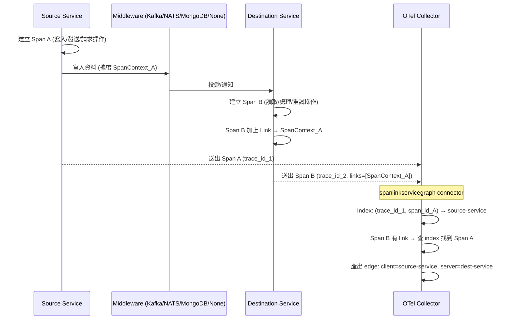
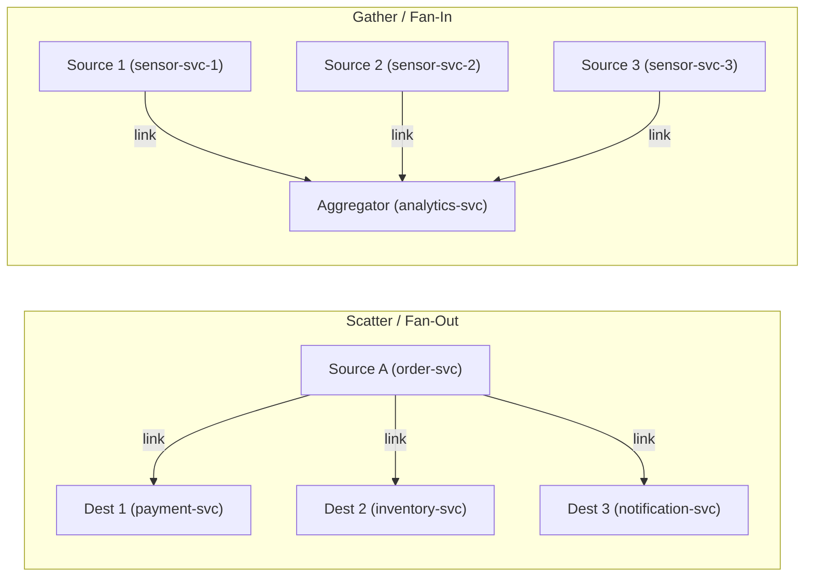
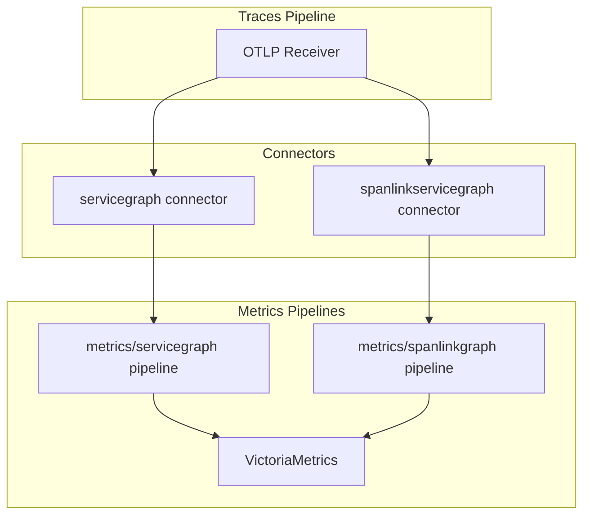
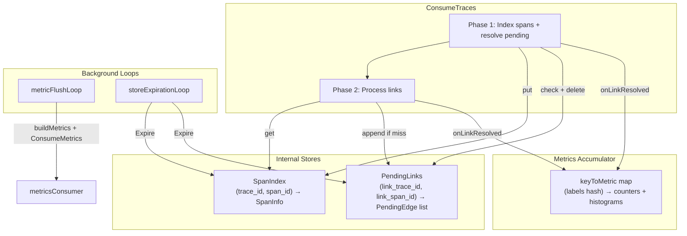

# Span Link Service Graph Connector 設計計畫

## 一、現有 servicegraph connector 行為摘要

現有 `servicegraph` connector（[opentelemetry-collector-contrib](https://github.com/open-telemetry/opentelemetry-collector-contrib/tree/main/connector/servicegraphconnector)）的關鍵事實：

- **配對方式**：以 `(TraceID, SpanID)` 對 CLIENT/PRODUCER、`(TraceID, ParentSpanID)` 對 SERVER/CONSUMER 做 key，兩邊配對成一條 edge
- **不處理 span links**：完全不讀取 `span.Links()`
- **輸出 metric 名稱**：`traces_service_graph_request_total`、`traces_service_graph_request_failed_total`、`traces_service_graph_request_server`（histogram）、`traces_service_graph_request_client`（histogram）
- **固定 labels**：`client`、`server`、`connection_type`、`failed`
- **可選 labels**：`virtual_node`、以及透過 `dimensions` 設定的額外維度

---

## 二、應用程式端 Span Link 標準化規範

### 2.0 泛用原則

Connector 對 span link 的處理**不綁定任何特定中介系統**。核心只依賴：

- 每個 span 的 `(trace_id, span_id)` + `resource.service.name`
- span.links 中的 `(link.trace_id, link.span_id)`

以下屬性皆為**可選的豐富化欄位**，connector 會盡量從 span/link attributes 中提取，但不強制要求：

- `messaging.system` / `db.system` → 用於填充 `connection_type` label
- `messaging.destination.name` / `db.namespace` → 用於可選 dimension
- `link_type` → 使用者自訂的語義分類

### 2.1 場景 A：Message Queue（Kafka / NATS / RabbitMQ 等）

**Source 端（Producer / Publisher）：**

```
span name: "orders publish"
span.kind: PRODUCER
resource.attributes:
  service.name: "order-service"
span.attributes:
  messaging.system: "kafka"              # 或 "nats", "rabbitmq" 等
  messaging.destination.name: "orders-topic"
  messaging.operation.type: "publish"
```

- 將 SpanContext（trace_id, span_id）透過 propagator 寫入 message header（如 Kafka header 的 `traceparent`、NATS header 等）

**Destination 端（Consumer / Subscriber）：**

```
span name: "orders process"
span.kind: CONSUMER
resource.attributes:
  service.name: "payment-service"
span.attributes:
  messaging.system: "kafka"
  messaging.destination.name: "orders-topic"
  messaging.operation.type: "process"
span.links:
  - trace_id: <producer_trace_id>
    span_id: <producer_span_id>
    attributes:
      link_type: "queue_enq_deq"         # 可選
```

### 2.2 場景 B：Database Change Stream / CDC（MongoDB / PostgreSQL 等）

**Source 端（Writer）：**

```
span name: "orders insert"
span.kind: CLIENT
resource.attributes:
  service.name: "order-service"
span.attributes:
  db.system: "mongodb"
  db.namespace: "ecommerce.orders"
  db.operation.name: "insert"
```

- 將 SpanContext 寫入 document 的 metadata 欄位（如 `_trace_context`）或透過 application-level 機制傳遞

**Destination 端（Change Stream Listener / CDC Consumer）：**

```
span name: "orders change_stream process"
span.kind: CLIENT    # 或 INTERNAL
resource.attributes:
  service.name: "sync-service"
span.attributes:
  db.system: "mongodb"
  db.namespace: "ecommerce.orders"
span.links:
  - trace_id: <writer_trace_id>
    span_id: <writer_span_id>
    attributes:
      link_type: "change_stream"         # 或 "cdc"
```

### 2.3 場景 C：Batch Processing（批次處理）— OTel Spec 明列場景

> 出處：[OTel Spec - Links between spans](https://opentelemetry.io/docs/specs/otel/overview/#links-between-spans)
> "Links can be used to represent batched operations where a Span was initiated by multiple initiating Spans, each representing a single incoming item being processed in the batch."

批次處理是 span link 的**核心設計動機之一**。一個批次處理 span link 回多個發起端 span，每個代表批次中的一筆輸入。

**發起端（多個快速請求各建立 span）：**

```
# 請求 1
span name: "POST /orders"
span.kind: SERVER
resource.attributes:
  service.name: "api-gateway"
# SpanContext_1 被記錄下來

# 請求 2
span name: "POST /orders"
span.kind: SERVER
resource.attributes:
  service.name: "api-gateway"
# SpanContext_2 被記錄下來

# ... 請求 N
```

**批次處理端：**

```
span name: "batch process orders"
span.kind: INTERNAL
resource.attributes:
  service.name: "batch-processor"
span.links:
  - trace_id: <request_1_trace_id>
    span_id: <request_1_span_id>
    attributes:
      link_type: "batch_input"
  - trace_id: <request_2_trace_id>
    span_id: <request_2_span_id>
    attributes:
      link_type: "batch_input"
  # ... link to request N
```

Connector 行為：N 個 link 各產出一條 edge（`client=api-gateway, server=batch-processor`），在 `traces_service_graph_request_total` 上累加 N。

### 2.4 場景 D：Trust Boundary（信任邊界 / 新 Trace 生成）— OTel Spec 明列場景

> 出處：[OTel Spec - Links between spans](https://opentelemetry.io/docs/specs/otel/overview/#links-between-spans)
> "Declare the relationship between the originating and following trace. This can be used when a Trace enters trusted boundaries of a service and service policy requires the generation of a new Trace rather than trusting the incoming Trace context."

當服務因安全政策不信任傳入的 trace context，需要產生全新 trace 時，用 link 連回原始 trace。此場景**不涉及任何中介系統**（非 queue、非 DB），是純粹的跨 trace 關聯。

**外部請求端：**

```
span name: "POST /api/payment"
span.kind: CLIENT
resource.attributes:
  service.name: "external-partner"
# SpanContext_ext 透過 HTTP header 傳入
```

**信任邊界內的服務（產生新 trace）：**

```
span name: "process payment"
span.kind: SERVER                  # 新 trace 的 root span
resource.attributes:
  service.name: "payment-gateway"
span.parent_id: ""                 # root span，無 parent
span.links:
  - trace_id: <external_trace_id>  # 連回不受信任的原始 trace
    span_id: <external_span_id>
    attributes:
      link_type: "trust_boundary"
```

Connector 行為：產出一條 edge（`client=external-partner, server=payment-gateway, edge_relation="link"`）。`connection_type` 為空（無中介系統）。

### 2.5 場景 E：Long-running Async Processing（長時間非同步處理）— OTel Spec 明列場景

> 出處：[OTel Spec - Links between spans](https://opentelemetry.io/docs/specs/otel/overview/#links-between-spans)
> "The new linked Trace may also represent a long running asynchronous data processing operation that was initiated by one of many fast incoming requests."

與 batch processing 類似，但強調**一個持續運行的長時間操作**由多個快速請求觸發。例如：多筆資料寫入觸發一次 ETL pipeline、多個事件累積後觸發一次報表生成。

**觸發端（多個快速寫入）：**

```
span name: "ingest event"
span.kind: SERVER
resource.attributes:
  service.name: "event-ingestion"
# 每次寫入產生一個 span，SpanContext 被記錄
```

**長時間處理端：**

```
span name: "daily ETL pipeline"
span.kind: INTERNAL
resource.attributes:
  service.name: "etl-service"
span.links:
  - trace_id: <event_1_trace_id>
    span_id: <event_1_span_id>
    attributes:
      link_type: "async_trigger"
  - trace_id: <event_2_trace_id>
    span_id: <event_2_span_id>
    attributes:
      link_type: "async_trigger"
  # ... 可能 link 到數百甚至數千個觸發事件
```

Connector 行為：同 batch processing，每個 link 各產出一條 edge。在高 fan-in 場景下，`traces_service_graph_request_total{client="event-ingestion", server="etl-service"}` 的值會反映觸發次數。

### 2.6 場景 F：Retry / Reprocessing（重試 / 重新處理）— 社群常見場景

重試操作以新 span（通常是新 trace）執行，用 link 連回原始失敗的 span，建立因果鏈。

**原始請求（失敗）：**

```
span name: "process order"
span.kind: SERVER
resource.attributes:
  service.name: "order-service"
span.status: ERROR
# SpanContext_original
```

**重試操作：**

```
span name: "process order (retry)"
span.kind: SERVER
resource.attributes:
  service.name: "order-service"    # 可能是同一服務，也可能是不同服務
span.links:
  - trace_id: <original_trace_id>
    span_id: <original_span_id>
    attributes:
      link_type: "retry"
      retry_count: "2"             # 可選
```

Connector 行為：

- 若同一服務重試：產出 `client=order-service, server=order-service`（self-referencing edge，合法）
- 若由不同服務重試（如 retry-service 代為重試）：產出 `client=order-service, server=retry-service`

### 2.7 場景涵蓋度總覽（對照 OTel 官方文件）

| OTel 官方 Use Case | 對應場景 | 狀態 |
|---|---|---|
| Async queued operations | 2.1 Message Queue | 完整覆蓋 |
| **Batched operations** | **2.3 Batch Processing** | **完整覆蓋** |
| **Trust boundary / new trace** | **2.4 Trust Boundary** | **完整覆蓋** |
| **Long-running async processing** | **2.5 Long-running Async** | **完整覆蓋** |
| Scatter/gather (fork/join) | 2.9 Scatter/Gather | 完整覆蓋 |
| **Retry / reprocessing** | **2.6 Retry** | **完整覆蓋** |
| Database change stream / CDC | 2.2 Database | 自行擴充（合理） |

### 2.8 流程圖（泛用，適用所有場景）



注意：Trust boundary 場景中 Middleware 可能不存在（直接 HTTP 呼叫）；Retry 場景中 Source 和 Destination 可能是同一服務。

### 2.9 Scatter/Gather（Fork/Join）模式 — OTel Spec 明列場景

> 出處：[OTel Spec - Links between spans](https://opentelemetry.io/docs/specs/otel/overview/#links-between-spans)
> "When using the scatter/gather (also called fork/join) pattern, the root operation starts multiple downstream processing operations and all of them are aggregated back in a single Span."



- **Scatter (fan-out)**：一個 source span 被多個 destination span link → 產出多條 edge
- **Gather (fan-in)**：一個 destination span link 到多個 source span → 產出多條 edge
- 適用場景：Kafka fan-out 到多個 consumer group、多個服務寫入同一 MongoDB collection 由一個 CDC listener 消費、fork/join 平行處理等

---

## 三、新元件設計：spanlinkservicegraph connector

### 3.1 元件類型與定位

- **類型**：traces-to-metrics connector（與 servicegraph 完全相同的 connector 模式）
- **Go package**：`spanlinkservicegraphconnector`
- **實作介面**：`connector.Traces`（= `component.Component` + `consumer.Traces`）
- **與現有 servicegraph 的關係**：完全獨立，共存於同一 Collector pipeline

### 3.2 核心 Data Flow



### 3.3 參考 servicegraph connector 的具體對應關係

本 connector 的設計直接參考 servicegraph connector 的以下模式，確保一致性：

**a) Config 結構（參考 servicegraph `config.go`）：**

| servicegraph 欄位 | 本 connector 欄位 | 差異說明 |
|---|---|---|
| `LatencyHistogramBuckets` | `LatencyHistogramBuckets` | 相同 |
| `Dimensions []string` | `Dimensions []Dimension` | 改為 `{Name, SourceAttribute}` 結構，支援泛用映射 |
| `Store.TTL` | `Store.TTL` | 預設改為 30s（跨 trace link 需更長 TTL） |
| `Store.MaxItems` | `Store.MaxItems` | 相同 |
| `MetricsFlushInterval` | `MetricsFlushInterval` | 相同機制 |
| `CacheLoop` | `CacheLoop` | 相同 |
| `StoreExpirationLoop` | `StoreExpirationLoop` | 相同 |
| `VirtualNodePeerAttributes` | 不適用 | link 場景無 virtual node 概念 |
| `DatabaseNameAttributes` | 不適用 | 由 dimensions 取代 |

**b) 聚合與 Metrics 建構（參考 servicegraph `connector.go`）：**

| servicegraph 模式 | 本 connector 對應 |
|---|---|
| `aggregateMetrics()` — 遍歷 spans，按 span kind 分 CLIENT/SERVER 配對 | `aggregateMetrics()` — 遍歷 spans，索引所有 span + 解析 links |
| `store.UpsertEdge(key, callback)` — 用 `(TraceID, SpanID)` 配對 | `spanIndex.Put(key, info)` + `pendingLinks` 解析 |
| `onComplete(edge)` — edge 雙邊就緒時觸發 | `onLinkResolved(srcInfo, dstInfo, linkAttrs)` — link 解析成功時觸發 |
| `buildMetrics()` — 從內部 map 建構 `pmetric.Metrics` | `buildMetrics()` — 相同模式，scope = `traces_service_graph` |
| `collectCountMetrics()` + `collectLatencyMetrics()` | 相同分離結構 |
| `metricsConsumer.ConsumeMetrics(ctx, md)` — 送出 metrics | 相同 |
| `metricFlushLoop` — 定時 flush | 相同 |
| `storeExpirationLoop` — 定時清理過期 edge | `storeExpirationLoop` — 定時清理過期 span index + pending links |

**c) Store 模式（參考 servicegraph `internal/store/`）：**

servicegraph 使用 `container/list` + `map[Key]*list.Element` 實作 TTL store。本 connector 需要兩個 store，但內部資料結構沿用相同模式：

- **SpanIndex Store**：用 `container/list` + `map` 實作 TTL cache，存 `SpanInfo`
- **PendingLinks Store**：同樣 `container/list` + `map`，存 `[]PendingEdge`
- 過期邏輯沿用 `tryEvictHead()` + `Expire()` 模式

### 3.4 內部架構



### 3.5 核心演算法（偽代碼）

```
func ConsumeTraces(traces):
  p.lock()

  // ===== Phase 1: 索引所有 span，並解析 pending links =====
  for each resourceSpans in traces:
    serviceName = resource.attributes["service.name"]

    for each scopeSpans in resourceSpans:
      for each span in scopeSpans:
        key = (span.trace_id, span.span_id)

        info = SpanInfo{
          ServiceName: serviceName,
          StartTime:   span.start_time,
          EndTime:     span.end_time,
          StatusCode:  span.status.code,
          Attributes:  extractAttributes(span),
        }

        spanIndex.Put(key, info)

        if pending = pendingLinks.GetAndDelete(key); pending exists:
          for each p in pending:
            p.onLinkResolved(info.ServiceName, p.DstService, info, p.DstSpanInfo, p.LinkAttrs)

  // ===== Phase 2: 處理所有 span 的 links =====
  for each resourceSpans in traces:
    dstService = resource.attributes["service.name"]

    for each scopeSpans in resourceSpans:
      for each span in scopeSpans:
        if len(span.links) == 0:
          continue

        dstSpanInfo = SpanInfo{...from span...}

        for each link in span.links:
          linkKey = (link.trace_id, link.span_id)

          if srcInfo = spanIndex.Get(linkKey); srcInfo exists:
            p.onLinkResolved(srcInfo.ServiceName, dstService, srcInfo, dstSpanInfo, link.attributes)
          else:
            pendingLinks.Append(linkKey, PendingEdge{
              DstService:  dstService,
              DstSpanInfo: dstSpanInfo,
              LinkAttrs:   link.attributes,
            })

  p.unlock()

  if p.config.MetricsFlushInterval != nil && *p.config.MetricsFlushInterval == 0:
    p.flushMetrics(ctx)


func onLinkResolved(clientService, serverService, srcInfo, dstInfo, linkAttrs):
  connectionType = resolveConnectionType(linkAttrs, dstInfo.Attrs, srcInfo.Attrs)

  metricKey = buildMetricKey(clientService, serverService, connectionType, dimensions...)
  series = p.keyToMetric[metricKey]

  series.reqTotal++
  if dstInfo.StatusCode == ERROR:
    series.reqFailedTotal++

  serverDuration = dstInfo.EndTime - dstInfo.StartTime
  series.serverHistogram.Record(serverDuration)

  if srcInfo != nil:
    clientDuration = srcInfo.EndTime - srcInfo.StartTime
    series.clientHistogram.Record(clientDuration)


func buildMetrics() pmetric.Metrics:
  md = pmetric.NewMetrics()
  rm = md.ResourceMetrics().AppendEmpty()
  sm = rm.ScopeMetrics().AppendEmpty()
  sm.Scope().SetName("traces_service_graph")

  p.seriesMutex.Lock()
  p.collectCountMetrics(sm)
  p.collectLatencyMetrics(sm)
  p.resetAccumulators()
  p.seriesMutex.Unlock()

  return md


func resolveConnectionType(linkAttrs, dstAttrs, srcAttrs):
  if v = linkAttrs["connection_type"]; v != "":
    return v
  if v = firstNonEmpty(linkAttrs["messaging.system"], dstAttrs["messaging.system"], srcAttrs["messaging.system"]):
    return v
  if v = firstNonEmpty(linkAttrs["db.system"], dstAttrs["db.system"], srcAttrs["db.system"]):
    return v
  return ""


func resolveDimension(dim Dimension, linkAttrs, dstAttrs, srcAttrs):
  return firstNonEmpty(linkAttrs[dim.SourceAttribute], dstAttrs[dim.SourceAttribute], srcAttrs[dim.SourceAttribute])
```

---

## 四、Metrics 與 Labels 設計

### 4.1 輸出 Metric 列表

| Metric 名稱 | 類型 | 說明 |
|---|---|---|
| `traces_service_graph_request_total` | Counter | link edge 的請求總數 |
| `traces_service_graph_request_failed_total` | Counter | link edge 的失敗請求數 |
| `traces_service_graph_request_server` | Histogram | 目的端（consumer）span 的延遲 |
| `traces_service_graph_request_client` | Histogram | 來源端（producer）span 的延遲（若可取得） |

### 4.2 Labels 詳細設計

**固定 labels（每條 metric 必有）：**

- `client` — 來源服務名稱（被 link 到的 span 的服務）。優先順序：link.attributes["client_service"] > spanIndex 查得的 resource.service.name
- `server` — 目的服務名稱（持有 link 的 span 的服務）。來自 resource.service.name
- `connection_type` — 中介系統類型。泛用解析順序：
  1. link.attributes["connection_type"]（明確指定）
  2. `messaging.system`（如 "kafka", "nats", "rabbitmq"）
  3. `db.system`（如 "mongodb", "postgresql"）
  4. 空字串（無法辨識時）
- `failed` — 是否失敗。取自目的端 span 的 status code
- `edge_relation` — 固定值 `"link"`，用於與 servicegraph 的 metrics 區分

**可選 labels（透過 config `dimensions` 啟用，每個 dimension 均按 link attrs → dst span attrs → src span attrs 順序取值）：**

- `messaging_system` — OTel semantic: `messaging.system`（"kafka", "nats", "rabbitmq" 等）
- `messaging_destination` — OTel semantic: `messaging.destination.name`（topic/queue/subject 名稱）
- `db_system` — OTel semantic: `db.system`（"mongodb", "postgresql" 等）
- `db_namespace` — OTel semantic: `db.namespace`（database.collection 名稱）
- `link_type` — 使用者自訂語義分類，來自 link.attributes["link_type"]，建議值：
  - Messaging 場景：`"queue_enq_deq"`, `"pub_sub"`, `"fan_out"`, `"fan_in"`
  - Database 場景：`"change_stream"`, `"cdc"`, `"write_read"`
  - Batch/Async 場景：`"batch_input"`, `"async_trigger"`, `"scheduled_trigger"`
  - Trust/Retry 場景：`"trust_boundary"`, `"retry"`
  - Scatter/Gather 場景：`"scatter"`, `"gather"`, `"fork_join"`

### 4.3 與現有 servicegraph 的 metrics 在 VictoriaMetrics 中的共存

查詢範例：

```promql
# 只看傳統 parent-child 邊（現有 servicegraph，沒有 edge_relation label）
traces_service_graph_request_total{edge_relation=""}

# 只看 span link 邊
traces_service_graph_request_total{edge_relation="link"}

# 同時看兩種邊（用於完整 service graph 視圖）
traces_service_graph_request_total

# --- Messaging 場景 ---
traces_service_graph_request_total{edge_relation="link", connection_type="kafka"}
traces_service_graph_request_total{edge_relation="link", connection_type="nats"}
traces_service_graph_request_total{edge_relation="link", messaging_system!=""}

# --- Database 場景 ---
traces_service_graph_request_total{edge_relation="link", connection_type="mongodb"}
traces_service_graph_request_total{edge_relation="link", link_type="change_stream"}

# --- 通用查詢 ---
traces_service_graph_request_total{edge_relation="link", client="order-service"}
traces_service_graph_request_total{edge_relation="link", server="analytics-service"}
```

---

## 五、Configuration 設計

### 5.1 Go Config Struct（參考 servicegraph `config.go`）

```go
type Config struct {
    LatencyHistogramBuckets []time.Duration `mapstructure:"latency_histogram_buckets"`
    Dimensions              []Dimension     `mapstructure:"dimensions"`
    Store                   StoreConfig     `mapstructure:"store"`
    CacheLoop               time.Duration   `mapstructure:"cache_loop"`
    StoreExpirationLoop     time.Duration   `mapstructure:"store_expiration_loop"`
    MetricsFlushInterval    *time.Duration  `mapstructure:"metrics_flush_interval"`
}

type Dimension struct {
    Name            string `mapstructure:"name"`
    SourceAttribute string `mapstructure:"source_attribute"`
}

type StoreConfig struct {
    MaxItems int           `mapstructure:"max_items"`
    TTL      time.Duration `mapstructure:"ttl"`
}
```

**預設值：**

- `Store.TTL`: 30s（比 servicegraph 的 2s 長，因為跨 trace link 到達時間差較大）
- `Store.MaxItems`: 10000
- `CacheLoop`: 1 minute
- `StoreExpirationLoop`: 2s
- `MetricsFlushInterval`: 60s

### 5.2 YAML 設定

```yaml
spanlinkservicegraph:
  latency_histogram_buckets: [5ms, 10ms, 25ms, 50ms, 100ms, 250ms, 500ms, 1s, 2s, 5s, 10s]

  dimensions:
    - name: messaging_system
      source_attribute: messaging.system
    - name: messaging_destination
      source_attribute: messaging.destination.name
    - name: db_system
      source_attribute: db.system
    - name: db_namespace
      source_attribute: db.namespace
    - name: link_type
      source_attribute: link_type

  store:
    ttl: 30s
    max_items: 10000

  cache_loop: 1m
  store_expiration_loop: 2s
  metrics_flush_interval: 60s
```

### 5.3 完整 Collector 設定範例

```yaml
receivers:
  otlp:
    protocols:
      grpc:
        endpoint: 0.0.0.0:4317

connectors:
  servicegraph:
    latency_histogram_buckets: [5ms, 10ms, 25ms, 50ms, 100ms, 250ms, 500ms, 1s, 2s, 5s, 10s]
    store:
      ttl: 10s
      max_items: 1000

  spanlinkservicegraph:
    latency_histogram_buckets: [5ms, 10ms, 25ms, 50ms, 100ms, 250ms, 500ms, 1s, 2s, 5s, 10s]
    dimensions:
      - name: messaging_system
        source_attribute: messaging.system
      - name: link_type
        source_attribute: link_type
    store:
      ttl: 30s
      max_items: 10000

exporters:
  prometheusremotewrite:
    endpoint: http://victoriametrics:8428/api/v1/write

service:
  pipelines:
    traces:
      receivers: [otlp]
      exporters: [servicegraph, spanlinkservicegraph]

    metrics/servicegraph:
      receivers: [servicegraph]
      exporters: [prometheusremotewrite]

    metrics/spanlinkgraph:
      receivers: [spanlinkservicegraph]
      exporters: [prometheusremotewrite]
```

---

## 六、Go 專案結構（contrib 規範）

開發階段在此 repo 中，結構模仿 contrib 的 `connector/spanlinkservicegraphconnector/`，以便後續直接搬移：

```
otel-span-link-connector/
├── connector/
│   └── spanlinkservicegraphconnector/
│       ├── go.mod
│       ├── go.sum
│       ├── Makefile
│       ├── doc.go
│       ├── metadata.yaml
│       ├── config.go
│       ├── factory.go
│       ├── connector.go
│       ├── util.go
│       ├── internal/
│       │   ├── metadata/        (mdatagen 生成)
│       │   ├── metadatatest/    (mdatagen 生成)
│       │   └── store/
│       │       ├── store.go
│       │       └── store_test.go
│       ├── config_test.go
│       ├── factory_test.go
│       ├── connector_test.go
│       ├── util_test.go
│       ├── generated_component_test.go  (mdatagen 生成)
│       ├── generated_package_test.go    (mdatagen 生成)
│       ├── testdata/
│       │   ├── config.yaml
│       │   ├── kafka-link-trace.yaml
│       │   ├── kafka-link-expected-metrics.yaml
│       │   ├── ... (各場景的 golden test data)
│       │   └── cross-batch-expected-metrics.yaml
│       ├── README.md
│       └── documentation.md             (mdatagen 生成)
├── Makefile.Common
├── README.md
├── docs/
│   ├── design-plan.md
│   └── contrib-guide.md
└── examples/
    ├── collector-config.yaml
    └── docker-compose.yaml
```

### 6.1 metadata.yaml 內容

```yaml
type: spanlinkservicegraph
display_name: Span Link Service Graph Connector

status:
  class: connector
  stability:
    development: [traces_to_metrics]
  distributions: []
  codeowners:
    active: [<your-github>, <sponsor-github>, <third-codeowner>]

tests:
  config:

telemetry:
  metrics:
    connector_spanlinkservicegraph_total_edges:
      description: Total number of link edges resolved
      unit: "1"
      enabled: true
      stability: development
      sum:
        value_type: int
        monotonic: true
    connector_spanlinkservicegraph_expired_spans:
      description: Number of indexed spans expired before being linked
      unit: "1"
      enabled: true
      stability: development
      sum:
        value_type: int
        monotonic: true
    connector_spanlinkservicegraph_expired_pending_links:
      description: Number of pending links expired before resolution
      unit: "1"
      enabled: true
      stability: development
      sum:
        value_type: int
        monotonic: true
    connector_spanlinkservicegraph_dropped_spans:
      description: Number of spans dropped due to store capacity
      unit: "1"
      enabled: true
      stability: development
      sum:
        value_type: int
        monotonic: true
```

### 6.2 Go Module 路徑

- **開發期**：`github.com/<your-org>/otel-span-link-connector/connector/spanlinkservicegraphconnector`
- **捐贈到 contrib 後**：改為 `github.com/open-telemetry/opentelemetry-collector-contrib/connector/spanlinkservicegraphconnector`

### 6.3 依賴版本

鎖定與 contrib 相同的 collector 版本，核心依賴：

- `go.opentelemetry.io/collector/connector`
- `go.opentelemetry.io/collector/consumer`
- `go.opentelemetry.io/collector/pdata`（ptrace, pmetric, pcommon）
- `go.opentelemetry.io/collector/component`
- `go.opentelemetry.io/collector/confmap`

### 6.4 測試策略（contrib 規範）

| 測試類型 | 檔案 | 說明 |
|---|---|---|
| Config 載入 | `config_test.go` | 用 `confmaptest.LoadConf()` + `sub.Unmarshal(cfg)` |
| Factory | `factory_test.go` | 驗證 `CreateTracesToMetrics` 回傳 valid connector |
| Golden test | `connector_test.go` | 輸入 `testdata/*-trace.yaml` → `ConsumeTraces` → `buildMetrics` → `pmetrictest.CompareMetrics(expected)` |
| Store 單元 | `store/store_test.go` | TTL expiry、max items、concurrent access |
| Generated | `generated_component_test.go` | mdatagen 自動生成：lifecycle、factory type |
| Goroutine leak | `generated_package_test.go` | `goleak.VerifyTestMain(m)` |

---

## 七、關鍵設計決策與邊界情況

### 7.1 跨批次解析

Span link 的目標 span 可能在不同批次（甚至不同時間）到達 Collector。Pending Links 機制處理此情況，TTL 設定（建議 30s）需要根據實際 span 到達延遲調整。

### 7.2 TTL 過期的 Pending Links

若 link 目標 span 在 TTL 內未到達：

- 記錄內部 telemetry metric（`connector_spanlinkservicegraph_expired_pending_links`）
- 可選策略：仍然產出 edge，但 `client` 設為 `"unknown"`（可設定）

### 7.3 同一 Collector 可見性

此設計假設 Producer 和 Consumer 的 span 都送到同一個 Collector 實例。若使用多 Collector 部署：

- **方案 A**（推薦）：使用 load balancing exporter 按 `trace_id` 路由到同一 Collector
- **方案 B**：在 Consumer 端的 link attributes 中主動寫入 `client_service`，讓 connector 不需要查 index 也能取得來源服務名

### 7.4 Edge 方向約定

- 持有 link 的 span 是 **destination**（`server`）
- 被 link 到的 span 是 **source**（`client`）
- 語義：`client` → `server` = Producer → Consumer

### 7.5 Latency 語義差異

- 對於 request edge：client latency 包含網路 + server 處理時間
- 對於 link edge：client/server latency 分別是各自 span 的獨立 duration，不包含 queue/DB 等待時間
- 未來可考慮增加 `traces_service_graph_request_queue_delay`（= dst.start_time - src.end_time）但不在此版範圍

### 7.6 泛用性設計原則

- Connector 核心演算法**不包含任何 messaging/database 的特殊分支邏輯**，僅做：span index → link resolution → emit edge
- `connection_type` 的解析是一個**有序 fallback chain**（link attrs → messaging.system → db.system → 空），新增系統只需擴展 chain，不需修改核心邏輯
- `dimensions` 設計為 `{name, source_attribute}` 映射，使用者可自由新增任何 OTel semantic convention attribute 或自訂 attribute 作為 metric label，connector 無需知道具體語義
- 不對 `span.kind` 做限制：不只處理 PRODUCER/CONSUMER，任何 kind 的 span（包括 CLIENT、INTERNAL）只要帶有 span links 都會被處理

### 7.7 Contrib 與獨立 Module 的雙軌相容性

遵照 contrib 規範開發**不會**限制獨立使用的能力：

- Contrib 中每個 component 都有獨立 `go.mod`，天生就是一個獨立 Go module
- 獨立使用方式：使用者在 OCB 的 `builder-config.yaml` 中引用此 module
- 捐贈到 contrib 後：只需將 module path 改為 contrib 路徑，程式碼無需其他修改
- 轉換成本為零

---

## 八、實作順序

### Phase 0a — 設計文件入庫

將 `docs/design-plan.md` 與 `docs/contrib-guide.md` 加入 repository。

### Phase 0b — 建立 Branch

```bash
git checkout -b feat/spanlinkservicegraph
```

### Phase 1 — Contrib 規範骨架

1. 建立目錄結構 `connector/spanlinkservicegraphconnector/`
2. `go mod init` 初始化 Go module
3. 撰寫 `metadata.yaml`
4. 撰寫 `doc.go`
5. 撰寫 `Makefile`
6. 撰寫 `config.go`（Config struct + Validate）
7. 撰寫 `factory.go`（NewFactory + createTracesToMetricsConnector 空殼）
8. 撰寫 `connector.go`（空殼 Start/Shutdown/ConsumeTraces + Capabilities）
9. 執行 mdatagen 生成 `internal/metadata/`、`generated_*_test.go`、`documentation.md`
10. 確認 `go build` 和 `go test` 通過

### Phase 2a — Internal Store

1. 實作 `internal/store/store.go`（SpanIndexStore + PendingLinksStore）
2. 實作 `store/store_test.go`

### Phase 2b — 核心邏輯

1. `connector.go` — `ConsumeTraces`
2. `connector.go` — `buildMetrics`
3. `connector.go` — Background loops
4. `util.go` — 輔助函式

### Phase 3 — 測試

1. `config_test.go`
2. `factory_test.go`
3. `connector_test.go` — Golden tests（8 個場景）
4. `util_test.go`

### Phase 4 — 文件

1. `README.md`
2. `examples/collector-config.yaml`
3. `examples/docker-compose.yaml`

### 後續 — 捐贈到 contrib

1. 在 contrib repo 開 Issue
2. 找到 sponsor + 湊齊 3 位 code owners
3. 分階段 PR 合併
