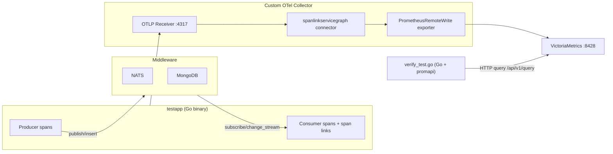

# Span Link Service Graph Connector 整合測試計畫

## 整體架構



## 目錄結構

```
integration-tests/
├── docker-compose.yaml              # 完整測試環境定義
├── collector/
│   ├── Dockerfile                    # 多階段：OCB 建置 + distroless
│   ├── builder-config.yaml           # OCB manifest，引用本地 connector module
│   └── otelcol-config.yaml           # 測試用 Collector pipeline 設定
├── testapp/
│   ├── Dockerfile                    # Go binary，生成所有測試情境的 traces
│   ├── go.mod
│   └── main.go                       # 依序執行各場景，產生帶 span link 的 traces
├── verify/
│   ├── Dockerfile                    # Go test binary
│   ├── go.mod
│   └── verify_test.go               # 用 prometheus/client_golang API 查詢 VM 並斷言
├── scripts/
│   └── run-tests.sh                  # 入口：compose up → 等待 → 驗證 → compose down
└── README.md
```

## 1. 自訂 Collector Image 建置

### `integration-tests/collector/Dockerfile`（多階段建置）

- **Stage 1 (builder)**：`golang:1.25`
  - 安裝 `go.opentelemetry.io/collector/cmd/builder@v0.147.0`
  - 複製 `connector/spanlinkservicegraphconnector/` 原始碼到 `/src/`
  - 複製 `builder-config.yaml` 到 `/build/`
  - 執行 `builder --config builder-config.yaml`
  - 在生成的 module 中加 `replace` 指向本地原始碼：

```
go mod edit -replace github.com/qiumingzhi/otel-span-link-connector/connector/spanlinkservicegraphconnector=/src/connector/spanlinkservicegraphconnector
```

- `go mod tidy && go build`
- **Stage 2**：`gcr.io/distroless/base-debian12`
  - 複製 binary + `otelcol-config.yaml`

### `integration-tests/collector/builder-config.yaml`

```yaml
dist:
  name: otelcol-spanlink
  output_path: ./otelcol-dev

receivers:
  - gomod: go.opentelemetry.io/collector/receiver/otlpreceiver v0.147.0

connectors:
  - gomod: github.com/qiumingzhi/otel-span-link-connector/connector/spanlinkservicegraphconnector v0.0.0

exporters:
  - gomod: github.com/open-telemetry/opentelemetry-collector-contrib/exporter/prometheusremotewriteexporter v0.147.0

extensions:
  - gomod: go.opentelemetry.io/collector/extension/zpagesextension v0.147.0
```

### `integration-tests/collector/otelcol-config.yaml`

- `metrics_flush_interval: 5s`（縮短，加速測試驗證）
- `store.ttl: 30s`、`store.max_items: 10000`
- `dimensions`: messaging_system, messaging_destination, db_system, db_namespace, link_type
- Pipeline: traces → spanlinkservicegraph → prometheusremotewrite → VictoriaMetrics

## 2. 測試應用程式（testapp）

用 Go 撰寫一個測試程式，初始化 OTel SDK（OTLP gRPC exporter → Collector），依序執行以下場景：

### 場景 A：NATS Queue（基本 producer → consumer）

1. 建立 producer span（`service.name=order-service`, `messaging.system=nats`）
2. 將 `(trace_id, span_id)` 寫入 NATS message header
3. 透過 NATS 發送訊息到 subject `orders`
4. Consumer 訂閱 `orders`，收到訊息後建立 consumer span（`service.name=payment-service`）
5. Consumer span 加上 span link 指向 producer span，`link_type=queue_enq_deq`
6. **預期 metric**：`traces_service_graph_request_total{client="order-service", server="payment-service", connection_type="nats", edge_relation="link"}`

### 場景 B：MongoDB Change Stream（writer → CDC listener）

1. 建立 writer span（`service.name=order-service`, `db.system=mongodb`）
2. 將 `(trace_id, span_id)` 寫入 MongoDB document 欄位 `_otel_trace_id`, `_otel_span_id`
3. Change stream listener 偵測到新文件，提取 trace context
4. 建立 listener span（`service.name=sync-service`）+ span link，`link_type=change_stream`
5. **預期 metric**：`traces_service_graph_request_total{client="order-service", server="sync-service", connection_type="mongodb", edge_relation="link"}`

### 場景 C：NATS Fan-out（1 producer → 3 consumers）

1. 一個 producer 發送到 NATS subject `events`
2. 三個 consumer（payment-svc, inventory-svc, notification-svc）各自訂閱並建立 span link
3. **預期**：3 條 edge，各自不同 server label

### 場景 D：跨批次到達（consumer 先到，producer 後到）

1. 先送出 consumer span（帶 span link 指向尚未送出的 producer span）
2. 等待 2 秒後再送出 producer span
3. **預期**：pending link 在 producer 到達後解析，metric 正確產出

### 場景 E：Retry

1. 建立 order-service 失敗 span（`status=ERROR`）
2. 建立 order-service retry span + span link 指向原始 span，`link_type=retry`
3. **預期**：`client=order-service, server=order-service`（self-referencing edge）

## 3. Metrics 驗證（Go 測試程式）

使用 Go + `github.com/prometheus/client_golang/api` 撰寫結構化的測試程式，取代 shell script，提升可讀性與擴充性。

### `integration-tests/verify/verify_test.go`

```go
package verify

import (
    "context"
    "fmt"
    "os"
    "testing"
    "time"

    "github.com/prometheus/client_golang/api"
    promv1 "github.com/prometheus/client_golang/api/prometheus/v1"
    "github.com/prometheus/common/model"
    "github.com/stretchr/testify/assert"
    "github.com/stretchr/testify/require"
)

func vmAPI(t *testing.T) promv1.API {
    t.Helper()
    addr := os.Getenv("VM_URL")
    if addr == "" {
        addr = "http://localhost:8428"
    }
    client, err := api.NewClient(api.Config{Address: addr})
    require.NoError(t, err)
    return promv1.NewAPI(client)
}

func queryScalar(t *testing.T, v1api promv1.API, promql string) float64 {
    t.Helper()
    ctx, cancel := context.WithTimeout(context.Background(), 10*time.Second)
    defer cancel()

    result, warnings, err := v1api.Query(ctx, promql, time.Now())
    require.NoError(t, err)
    require.Empty(t, warnings)

    vec, ok := result.(model.Vector)
    require.True(t, ok, "expected vector result for query: %s", promql)
    require.NotEmpty(t, vec, "no data for query: %s", promql)
    return float64(vec[0].Value)
}

// --- 場景 A：NATS Queue ---
func TestScenarioA_NATSQueue(t *testing.T) {
    v := vmAPI(t)
    val := queryScalar(t, v,
        `traces_service_graph_request_total{client="order-service",server="payment-service",connection_type="nats",edge_relation="link"}`)
    assert.GreaterOrEqual(t, val, float64(1))
}

// --- 場景 B：MongoDB Change Stream ---
func TestScenarioB_MongoDBChangeStream(t *testing.T) {
    v := vmAPI(t)
    val := queryScalar(t, v,
        `traces_service_graph_request_total{client="order-service",server="sync-service",connection_type="mongodb",edge_relation="link"}`)
    assert.GreaterOrEqual(t, val, float64(1))
}

// --- 場景 C：NATS Fan-out ---
func TestScenarioC_NATSFanOut(t *testing.T) {
    v := vmAPI(t)
    for _, server := range []string{"payment-svc", "inventory-svc", "notification-svc"} {
        t.Run(server, func(t *testing.T) {
            val := queryScalar(t, v, fmt.Sprintf(
                `traces_service_graph_request_total{client="event-source",server="%s",edge_relation="link"}`, server))
            assert.GreaterOrEqual(t, val, float64(1))
        })
    }
}

// --- 場景 D：跨批次到達 ---
func TestScenarioD_CrossBatch(t *testing.T) {
    v := vmAPI(t)
    val := queryScalar(t, v,
        `traces_service_graph_request_total{client="delayed-producer",server="eager-consumer",edge_relation="link"}`)
    assert.GreaterOrEqual(t, val, float64(1))
}

// --- 場景 E：Retry ---
func TestScenarioE_Retry(t *testing.T) {
    v := vmAPI(t)
    val := queryScalar(t, v,
        `traces_service_graph_request_total{client="order-service",server="order-service",edge_relation="link"}`)
    assert.GreaterOrEqual(t, val, float64(1))
}

// --- Histogram 驗證 ---
func TestHistograms(t *testing.T) {
    v := vmAPI(t)

    t.Run("server_histogram_count", func(t *testing.T) {
        val := queryScalar(t, v,
            `count(traces_service_graph_request_server_count{edge_relation="link"})`)
        assert.Greater(t, val, float64(0))
    })

    t.Run("client_histogram_count", func(t *testing.T) {
        val := queryScalar(t, v,
            `count(traces_service_graph_request_client_count{edge_relation="link"})`)
        assert.Greater(t, val, float64(0))
    })

    t.Run("server_histogram_sum_positive", func(t *testing.T) {
        val := queryScalar(t, v,
            `sum(traces_service_graph_request_server_sum{edge_relation="link"})`)
        assert.Greater(t, val, float64(0), "server duration sum should be > 0")
    })
}

// --- Mixed middleware（NATS + MongoDB） ---
func TestScenarioF_MixedMiddleware(t *testing.T) {
    v := vmAPI(t)

    t.Run("nats_leg", func(t *testing.T) {
        val := queryScalar(t, v,
            `traces_service_graph_request_total{client="order-service",server="payment-service",connection_type="nats",edge_relation="link"}`)
        assert.GreaterOrEqual(t, val, float64(1))
    })

    t.Run("mongodb_leg", func(t *testing.T) {
        val := queryScalar(t, v,
            `traces_service_graph_request_total{client="payment-service",server="sync-service",connection_type="mongodb",edge_relation="link"}`)
        assert.GreaterOrEqual(t, val, float64(1))
    })
}
```

### 優點

- **可讀性**：每個場景是獨立的 `Test*` 函式，`go test -v` 輸出清晰
- **擴充性**：新增場景只需加一個 `Test*` 函式，不用改 script 邏輯
- **型別安全**：prometheus client 幫你處理 JSON 解析與型別轉換
- **豐富斷言**：用 testify 的 `assert.GreaterOrEqual`、`assert.InDelta` 等做數值驗證
- **可重試**：可搭配 `require.Eventually` 等待 metrics 出現，處理 flush 延遲
- **CI 整合**：`go test -v` 回傳標準 exit code，直接對接 CI pipeline

### `integration-tests/verify/go.mod`

```
module github.com/qiumingzhi/otel-span-link-connector/integration-tests/verify

go 1.25.5

require (
    github.com/prometheus/client_golang
    github.com/prometheus/common
    github.com/stretchr/testify
)
```

### `integration-tests/verify/Dockerfile`

```dockerfile
FROM golang:1.25
WORKDIR /verify
COPY go.mod go.sum ./
RUN go mod download
COPY . .
ENTRYPOINT ["go", "test", "-v", "-count=1", "-timeout=60s", "./..."]
```

### `integration-tests/scripts/run-tests.sh`

```bash
#!/bin/bash
set -e
docker compose -f integration-tests/docker-compose.yaml up -d --build
# 等待所有服務就緒
sleep 10
# 等待 testapp 完成（它會自動退出）
docker compose -f integration-tests/docker-compose.yaml wait testapp
# 等待 metrics flush（collector 每 5 秒 flush）
sleep 15
# 執行 Go 測試驗證
docker compose -f integration-tests/docker-compose.yaml run --rm verify
# 清理
docker compose -f integration-tests/docker-compose.yaml down -v
echo "ALL TESTS PASSED"
```

## 4. docker-compose.yaml 服務定義

```yaml
services:
  nats:
    image: nats:latest
    ports: ["4222:4222"]

  mongodb:
    image: mongo:7
    ports: ["27017:27017"]
    command: ["--replSet", "rs0"]
    # 需要 replica set 才能使用 change stream

  mongodb-init:
    image: mongo:7
    depends_on: [mongodb]
    entrypoint: ["mongosh", "--host", "mongodb", "--eval", "rs.initiate()"]
    restart: "no"

  victoriametrics:
    image: victoriametrics/victoria-metrics:latest
    ports: ["8428:8428"]
    command: ["-retentionPeriod=1d", "-httpListenAddr=:8428"]

  collector:
    build:
      context: ..
      dockerfile: integration-tests/collector/Dockerfile
    depends_on: [victoriametrics]
    ports: ["4317:4317"]

  testapp:
    build:
      context: integration-tests/testapp
    depends_on: [collector, nats, mongodb-init]
    environment:
      OTEL_EXPORTER_OTLP_ENDPOINT: collector:4317
      NATS_URL: nats://nats:4222
      MONGODB_URI: mongodb://mongodb:27017/?replicaSet=rs0

  verify:
    build:
      context: verify
    depends_on: [testapp]
    environment:
      VM_URL: http://victoriametrics:8428
```

## 5. 額外應納入的整合測試場景

除了使用者指定的場景外，以下場景也建議納入整合測試：

- **TTL 過期測試**：送出帶 span link 的 consumer span，但故意不送 producer span，等 30s TTL 過期後確認 metric **未** 產出（或產出 `client=unknown`，取決於設計）。驗證 connector 不會無限累積記憶體。
- **Collector 重啟後恢復**：在第一輪 traces 送完後重啟 collector container，再送第二輪 traces，確認新的 edges 仍然能正確產出。驗證 connector 在 stateless 重啟後功能正常。
- **高並發寫入**：testapp 用多個 goroutine 同時送 50+ 條帶 span link 的 traces，驗證 metrics 數量正確且無 race condition。
- **Mixed middleware**：一條流程同時經過 NATS 和 MongoDB（order-service → NATS → payment-service → MongoDB → sync-service），確認兩段 link edge 都正確產出且 `connection_type` 分別為 `nats` 和 `mongodb`。
- **Histogram 數值驗證**：不只確認 histogram metric 存在，還驗證 `_count` 和 `_sum` 的大致合理性（如 server duration > 0）。

## 6. testapp 關鍵依賴

```
go.opentelemetry.io/otel
go.opentelemetry.io/otel/sdk
go.opentelemetry.io/otel/exporters/otlp/otlptrace/otlptracegrpc
github.com/nats-io/nats.go
go.mongodb.org/mongo-driver/v2
```

testapp 不需要 `otelmongo` instrumentation library — 我們手動建立 span 和 span link，因為重點是測試 connector 對 span link 的處理，而非測試自動 instrumentation。
