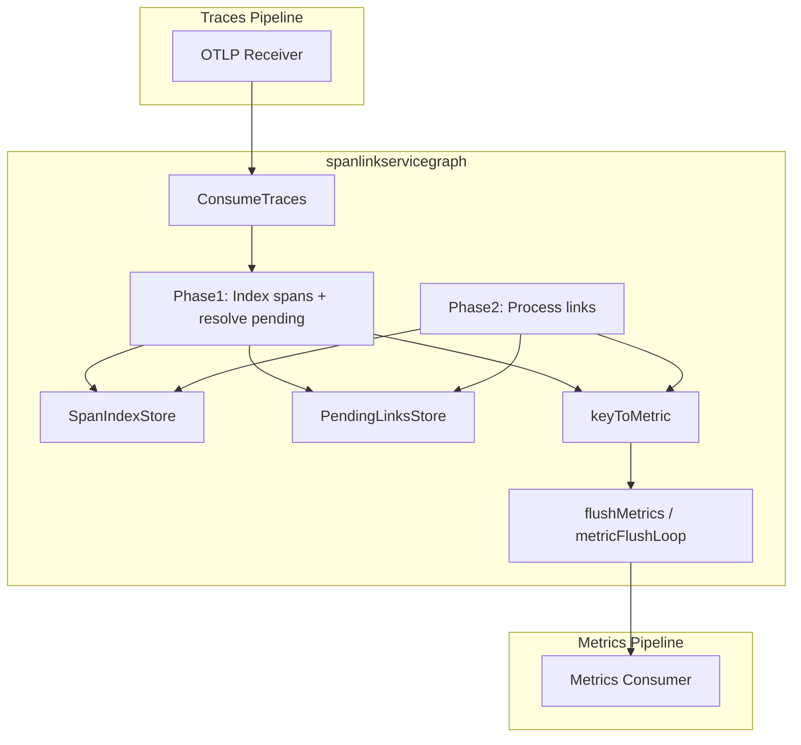

# Span Link Service Graph Connector — 專案說明與程式結構

## 一、專案在做什麼

本專案是一個 **OpenTelemetry Collector 的 traces-to-metrics connector**，名稱是 **spanlinkservicegraph**。它從 **span links**（跨 span、跨 trace 的連結）推導出「服務對服務」的邊（edge），並產出與現有 [servicegraph connector](https://github.com/open-telemetry/opentelemetry-collector-contrib/tree/main/connector/servicegraphconnector) **同名、可並存** 的 metrics，用 label `edge_relation="link"` 區分。

### 為什麼需要它

- **既有 servicegraph** 只根據 **parent-child**（同一 trace 內父子 span）建邊，看不到非同步、跨 trace 的關係。
- 許多場景是靠 **span links** 表達因果：Message Queue（Kafka/NATS）、DB Change Stream / CDC、批次處理、信任邊界、重試、Scatter/Gather 等。  
本 connector 專門處理這些 link，補足「非同步 / 跨 trace 的服務圖」。

### 涵蓋的場景（對應 [design-plan.md](design-plan.md)）

| 場景 | 說明 |
|------|------|
| Message Queue | Producer → 中介 → Consumer，Consumer span 帶 link 指回 Producer |
| Database CDC | Writer span → 文件/變更 → Change Stream listener span 帶 link |
| Batch Processing | 多個發起 span，一個 batch span 帶多個 link |
| Trust Boundary | 新 trace 的 root span 帶 link 指回外部 trace |
| Long-running Async | 多個觸發 span，一個長時間 span 帶多個 link |
| Retry | 重試 span 帶 link 指回原始失敗 span |
| Scatter/Gather | Fan-out / Fan-in，一個 span 被多個 link 或 link 到多個 span |

### 輸出 Metrics（與 servicegraph 相容、可並存）

- `traces_service_graph_request_total`（Counter）
- `traces_service_graph_request_failed_total`（Counter）
- `traces_service_graph_request_server`（Histogram，目的端 span 延遲）
- `traces_service_graph_request_client`（Histogram，來源端 span 延遲）

固定 label：`client`、`server`、`connection_type`、`failed`、`edge_relation="link"`。可選 label 透過設定 `dimensions`（name + source_attribute）從 span/link attributes 抽取。

---

## 二、整體資料流與架構



- **輸入**：`ptrace.Traces`（OTLP traces）。
- **輸出**：`pmetric.Metrics` 送給下一個 consumer（例如 Prometheus Remote Write → VictoriaMetrics）。
- **內部**：兩階段處理 + 兩個 TTL store + 一個 in-memory 累積 map，定時 flush 與過期清理。

---

## 三、程式碼結構與職責

目錄結構對應 [design-plan.md 6. Go 專案結構](design-plan.md)：

```
connector/spanlinkservicegraphconnector/
├── config.go / config_test.go    # 設定結構與驗證
├── factory.go / factory_test.go  # Collector 元件工廠
├── connector.go / connector_test.go  # 主邏輯：ConsumeTraces、aggregate、buildMetrics、flush
├── util.go / util_test.go        # 輔助：service name、connection_type、dimension 解析
├── doc.go                        # package 說明 + go:generate mdatagen
├── metadata.yaml                 # 元件元資料（type、stability、telemetry）
├── internal/
│   └── store/
│       ├── store.go              # SpanIndexStore、PendingLinksStore（TTL + 容量限制）
│       └── store_test.go
├── internal/metadata/            # mdatagen 產生：Type、ScopeName、Telemetry
└── testdata/                     # Golden 測試用 YAML
```

- **config**：連到 pipeline 的 YAML；**factory**：建立 connector 實例；**connector**：核心演算法與 metrics 建構；**util**：不綁特定中介的屬性解析；**store**：跨批次、跨 trace 的 span 索引與 pending link 佇列。

---

## 四、核心演算法與方法

### 4.1 入口：`ConsumeTraces`（[connector.go](../connector/spanlinkservicegraphconnector/connector.go)）

- 呼叫 `aggregateMetrics(td)` 處理本批 traces。
- 若設定 `metrics_flush_interval == 0`，則本批處理完立即 `flushMetrics(ctx)`；否則由背景 `metricFlushLoop` 定時 flush。

### 4.2 兩階段聚合：`aggregateMetrics`（[connector.go](../connector/spanlinkservicegraphconnector/connector.go)）

**Phase 1 — 索引 span + 解析「等這個 span 的」pending links**

- 遍歷 `ResourceSpans` → `ScopeSpans` → `Span`。
- 對每個 span：  
  - 從 resource 取 `service.name`（[util.go](../connector/spanlinkservicegraphconnector/util.go) 的 `findServiceName`）。  
  - 建 `SpanInfo`（ServiceName、StartTime、EndTime、StatusCode、`extractRelevantAttributes` 的屬性）。  
  - `spanIndex.Put(key, info)`，key = `(TraceID, SpanID)`。  
  - `pendingLinks.GetAndDelete(key)`：若有在「等這個 key」的 pending edges，逐一呼叫 `onLinkResolved(..., linkAttrs)`，完成邊的解析並寫入 `keyToMetric`。

**Phase 2 — 處理本批所有 span 的 links**

- 再次遍歷每個 span；若 `span.Links()` 為空則略過。
- 對當前 span 建 `dstSpanInfo`（目的端）。
- 對每個 `link`：  
  - `linkKey = (link.TraceID(), link.SpanID())`。  
  - 若 `spanIndex.Get(linkKey)` 有值 → 立即 `onLinkResolved(srcService, dstService, srcInfo, dstSpanInfo, link.Attributes())`。  
  - 否則 `pendingLinks.Append(linkKey, PendingEdge{...})`，等之後某批次的 span 帶著這個 key 進來時，在 Phase 1 被解析。

因此可支援：**consumer 先到、producer 後到** 的跨批次、跨 trace 情境（設計見 [design-plan 7.1、7.2](design-plan.md)）。

### 4.3 單邊解析：`onLinkResolved`（[connector.go](../connector/spanlinkservicegraphconnector/connector.go)）

- **Label 解析**（依設計）：  
  - `connection_type`： [util.go](../connector/spanlinkservicegraphconnector/util.go) 的 `resolveConnectionType(linkAttrs, dstAttrs, srcAttrs)`，順序為 link.connection_type → messaging.system → db.system → 空。  
  - `failed`：目的 span 的 `StatusCode == Error`。  
  - 可選維度：對每個 `config.Dimensions` 呼叫 `resolveDimension(dim, linkAttrs, dstAttrs, srcAttrs)`（`firstNonEmptyAttr` 依序從 link、dst、src 取）。
- **Metric 累積**：  
  - 用 `buildMetricKey(dims)` 得到 key（目前實作僅用 client、server、connection_type、failed、edge_relation；可選 dimensions 會寫進 data point attributes，但未參與 key，因此不同可選值會合併到同一 series）。  
  - 對 `keyToMetric[metricKey]` 的 `metricSeries`：  
    - `reqTotal++`；若 failed 則 `reqFailedTotal++`。  
    - 將 server/client 的 duration（毫秒）分別 append 到 `serverDurations`、`clientDurations`。

### 4.4 建構與送出 Metrics：`buildMetrics`、`flushMetrics`、背景迴圈（[connector.go](../connector/spanlinkservicegraphconnector/connector.go)）

- **buildMetrics()**：  
  - 鎖住 `seriesMu`，若 `keyToMetric` 為空則回傳空 `pmetric.Metrics`。  
  - 建立 `ResourceMetrics` / `ScopeMetrics`，`Scope().SetName(metadata.ScopeName)`（例如 `traces_service_graph`）。  
  - `collectCountMetrics(sm)`：對 `traces_service_graph_request_total`、`traces_service_graph_request_failed_total` 依每個 series 的 dimensions 建 Sum data points。  
  - `collectLatencyMetrics(sm)`：對 `traces_service_graph_request_server`、`traces_service_graph_request_client` 建 Histogram，bucket 來自 `config.LatencyHistogramBuckets`，`buildHistogramDataPoint` 依 `serverDurations`/`clientDurations` 與 bucket 算 counts/sum。  
  - `resetAccumulators()` 清空 `keyToMetric`，然後回傳 `md`。
- **flushMetrics(ctx)**：呼叫 `buildMetrics()`，若有 `ResourceMetrics` 則 `metricsConsumer.ConsumeMetrics(ctx, md)`。
- **metricFlushLoop**：依 `MetricsFlushInterval` 定時呼叫 `flushMetrics`，直到 `shutdownCh` 關閉。
- **storeExpirationLoop**：依 `StoreExpirationLoop` 定時呼叫 `spanIndex.Expire()`、`pendingLinks.Expire()`，過期項目從 list+map 移除並可觸發 onExpire 回呼（設計中的 telemetry 可掛在這裡）。

### 4.5 設定與工廠（[config.go](../connector/spanlinkservicegraphconnector/config.go)、[factory.go](../connector/spanlinkservicegraphconnector/factory.go)）

- **Config**：`LatencyHistogramBuckets`、`Dimensions`（name/source_attribute）、`Store`（TTL、MaxItems）、`CacheLoop`、`StoreExpirationLoop`、`MetricsFlushInterval`。`Validate()` 檢查 store 與 dimensions 必填。
- **createDefaultConfig**：預設 TTL=30s、MaxItems=10000、flush=60s 等（設計上 TTL 比 servicegraph 長以應付跨 trace 延遲）。
- **NewFactory**：註冊 `connector.WithTracesToMetrics(createTracesToMetricsConnector, ...)`。  
- **createTracesToMetricsConnector**：`newConnector(telemetry, cfg, nextConsumer)`，建立 `SpanIndexStore` / `PendingLinksStore`、`keyToMetric`、掛載 store 的 onExpire/onDrop 回呼，並在 `Start` 中啟動上述兩個 background loop。

### 4.6 內部 Store（[internal/store/store.go](../connector/spanlinkservicegraphconnector/internal/store/store.go)）

- **SpanIndexStore**：  
  - `map[SpanKey]*list.Element` + `list.List`（按寫入順序），每個 element 為 `spanEntry{key, info, expireAt}`。  
  - `Put(key, info)`：若已存在則更新並移到 list 尾；否則若達 `maxItems` 先 `evictOldest(1)` 再插入。  
  - `Get(key)`：回傳 `SpanInfo`。  
  - `Expire()`：從 list 頭移除 `expireAt <= now` 的項目並呼叫 `onExpire(count)`。
- **PendingLinksStore**：  
  - 結構類似，每個 element 為 `pendingEntry{key, edges []PendingEdge, expireAt}`。  
  - `Append(key, edge)`：同一 key 可對應多個 `PendingEdge`（例如多個 consumer link 到同一 producer）。  
  - `GetAndDelete(key)`：回傳並移除該 key 的所有 pending edges。  
  - `Expire()`：移除過期 entry，回傳過期 edge 數並可呼叫 `onExpire`。

這樣實作與 [design-plan 3.3c、3.4、3.5](design-plan.md) 的「SpanIndex + PendingLinks、TTL、定時 Expire」一致。

---

## 五、設計與實作對照摘要

| 設計要點（docs） | 實作位置 |
|------------------|----------|
| 僅依 (trace_id, span_id) + service.name + span.links，不綁特定中介 | util：`resolveConnectionType` / `resolveDimension` 泛用 fallback；connector 不認 messaging/db 語義 |
| 兩階段：先 index + 解 pending，再處理 links | `aggregateMetrics` Phase 1 / Phase 2 |
| 跨批次：pending link 等後到 span | `PendingLinksStore` + Phase 1 的 `GetAndDelete` + `onLinkResolved` |
| 與 servicegraph 同名 metrics、edge_relation=link 區分 | `metricReqTotal` 等常數、`dims["edge_relation"]="link"`、ScopeName |
| TTL / 容量限制、定時 Expire | `StoreConfig`、`SpanIndexStore`/`PendingLinksStore`、`storeExpirationLoop` |
| 可選 dimensions 從 link/dst/src 依序取值 | `resolveDimension` → `firstNonEmptyAttr` |
| 貢獻到 contrib 的結構與介面 | factory 註冊 TracesToMetrics、獨立 go.mod、metadata.yaml、[contrib-guide](contrib-guide.md) |

---

## 六、延伸閱讀

- 應用端如何產生 span link（Message Queue、CDC、Batch、Trust Boundary 等）：[design-plan 二、2.1–2.9](design-plan.md) 與 [connector README — Application Instrumentation Guide](../connector/spanlinkservicegraphconnector/README.md)。
- 與現有 servicegraph 並存、Pipeline 範例： [design-plan 3.2、5.3](design-plan.md)、[examples/collector-config.yaml](../examples/collector-config.yaml)。
- 整合測試架構與場景： [integration-test-plan.md](integration-test-plan.md)。
- 捐贈到 opentelemetry-collector-contrib 的流程與檔案清單： [contrib-guide.md](contrib-guide.md)。
